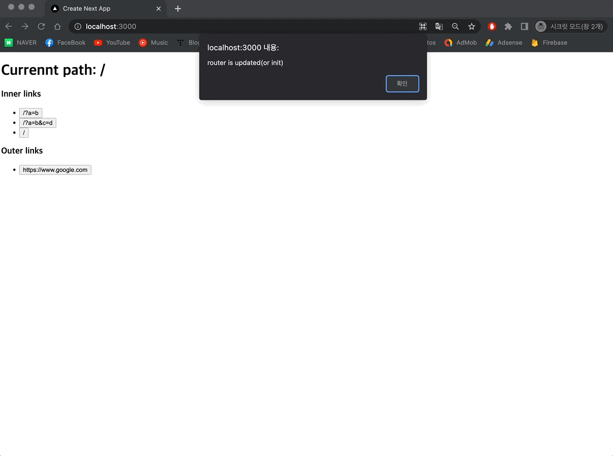
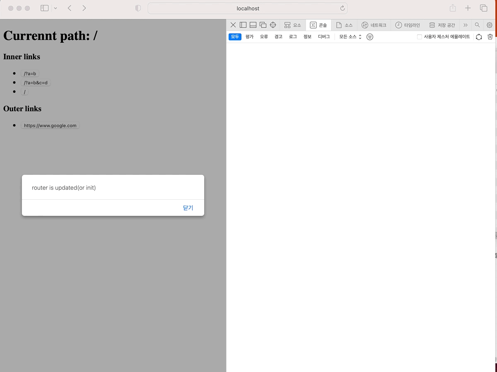
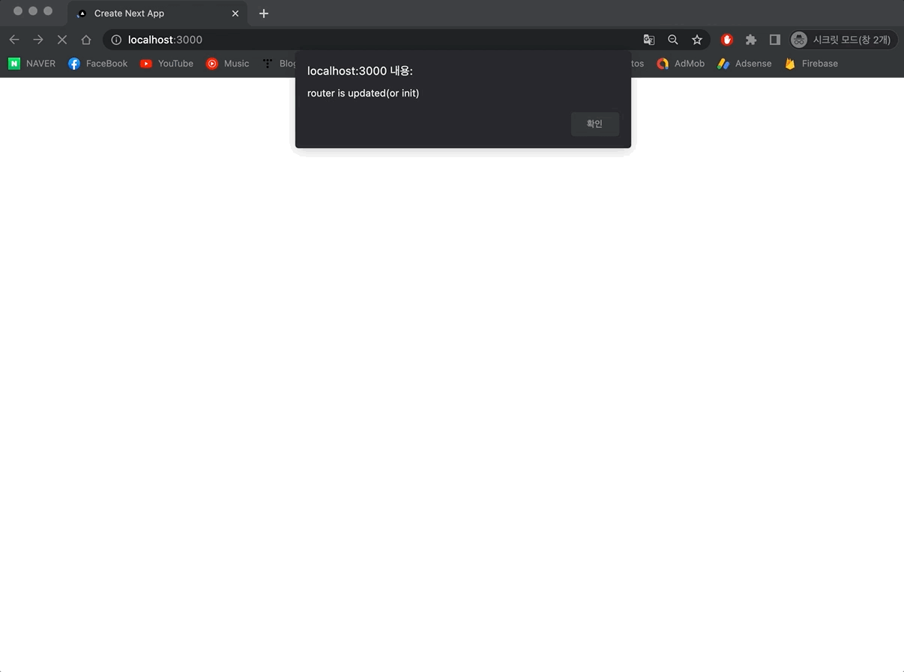
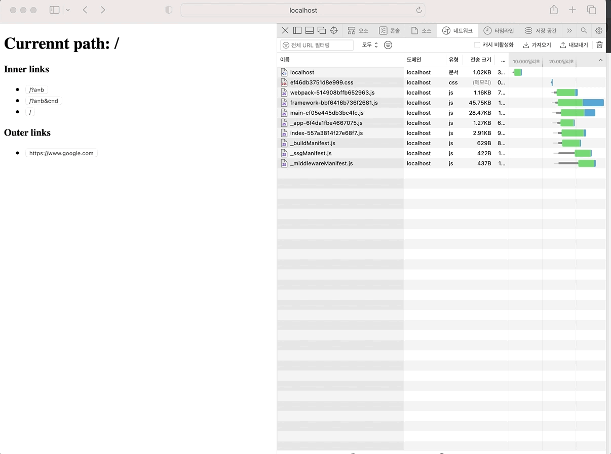

# Demo page

https://why-router-is-updated.vercel.app/

## How to invoke bug

1. enter page. (/)
2. click `/?a=b` button.
3. click `/?a=b&c=d` button.
4. click `www.google.com(Outer link)` button.
5. click back button.
6. bfcache is used. (page is restored without reload page)
7. but router is updated, and `useEffect(()=> {...}, [router])` is triggered.
   - page is restored from bfcache, thus router must be not updated. but router is updated, and effect is executed.
   - This bug is only generated from <b>desktop/mobile safari, mobile chrome.</b> (not generated from <b>desktop chrome</b>)

#### desktop chrome

      
- when page is restored from bfcache, router is not updated. (not showed router update message alert)

#### desktop safari

- when page is restored from bfcache, router is updated. ( showed router update message alert)

- same as mobile safari, mobile chrome.
- but diffrent from desktop chrome...

## What is problem?

Phase 7 is unexpected behavior.
(desktop/mobile safari and mobile chrome behavior is different from desktop chrome)

And also, in below situation, router is not updated on all browsers.

1. enter page. (/)
2. click `www.google.com(Outer link)` button.
3. click back button.
4. bfcache is used (page is restored without reload page)
5. <b>(important)</b> router is not updated on all browser.
   - so `useEffect(()=> {...}, [router])` is not triggered.

#### desktop chrome

      
- when page is restored from bfcache, router is not updated. (not showed router update message alert)

#### desktop safari

- when page is restored from bfcache, router is not updated. (not showed router update message alert)

- In this case, same as mobile safari, mobile chrome.
